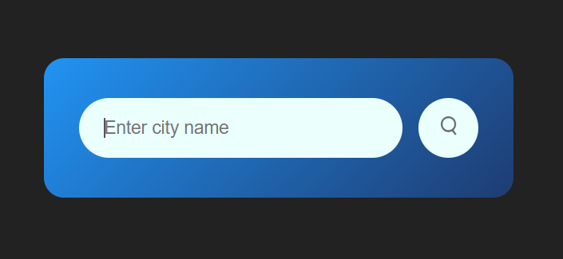

# 🌤️ Weather App

A simple and responsive weather application that allows users to search for any city and view real-time weather information.

---

## 📌 Project Idea
The Weather App enables users to enter a city name and instantly get current weather details such as:
- Temperature
- Weather condition
- Humidity
- Wind speed

The data is fetched dynamically using a weather API.

---

## 🛠️ Technologies Used
- HTML5
- CSS3
- JavaScript (ES6)
- OpenWeatherMap API

---

## 🖼️ Screenshots
Here are some screenshots of the app in action:

.png)

---

## 🚀 Features
- Search weather by city name
- Real-time weather data
- Clean and modern UI
- Responsive design

---

## 📂 Project Structure
Git_Course/
├── images/
│ ├── screenshot.png
│ ├── screenshot2.png
│ ├── wind.png
│ ├── snow.png
│ ├── search.png
│ ├── rain.gif
│ ├── mist.gif
│ ├── humidity.png
│ ├── drizzle.gif
│ ├── clouds.gif
│ └── clear.gif
├── index.html
├── style.css
└── README.md
---

## 📝 Project Notes
- This project is a practice app for learning HTML, CSS, and JavaScript.
- Fetches weather data using OpenWeatherMap API.
